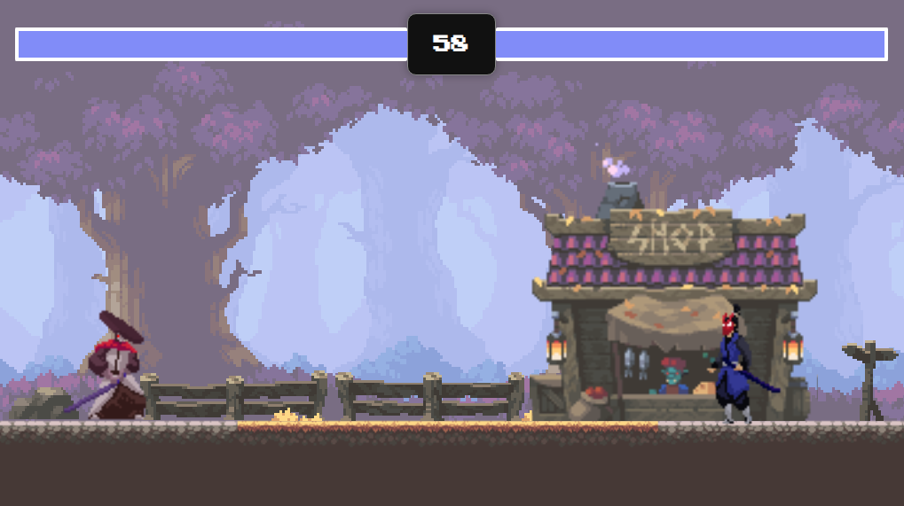

#  **JavaScript Fighting Game**

## 	&#127919; **About**
Um Jogo de luta entre duas pessoas, criado usando HTML e JavaScript, Com sistemas como Tempo, HitBox e Controles para um segundo Jogador.  
Este Projéto foi criado com base no tutorial do Canal <a href="https://www.youtube.com/c/ChrisCourses">Chris Courses</a> 

## 📋**My Experience**
Esse projéto foi especial para mim, foi o primeiro grande tutorial em outra lingua que eu segui(inglês), serviu muito para entender sobre o Canva e **Principalmente** sobre **POO**, consegui reforçar coisas sobre o POO que nem mesmo os cursos que ja fiz conseguiram me ajudar.

## 🔧 **Techs**

* HTML (Foi usado para dar corpo ao projéto e disponibilizar o canva)
* CSS (Interface)
* JavaScript (Criação do script geral do game)

## &#127775; **Features**
&#10004; Personagems Interativos e Animados &#10004; Timer &#10004; JavaScript Classes &#10004; Background Animado

## <a href="https://thiagofang.github.io/fighting-game-javascript/">**Clique aqui para visitar o Projéto**</a>

